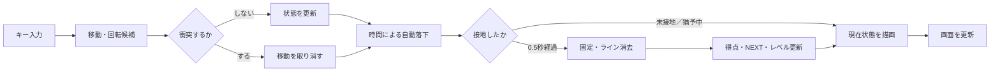

# 3D Tetris ― 作品説明（A4短縮版）

## 作品概要

Python、GLFW、PyOpenGL、NumPy、Pillowで制作した3Dテトリスである。10×20のフィールド上で7種類のテトリミノを操作し、揃ったラインを消去する。立方体のモデリング、階層変換、照明、材質、テクスチャ、透過、透視投影を、実際に遊べるゲームへ統合した。

### 画面構成

```text
┌──────────┬──────────────────────┬──────────┐
│   HOLD   │     10×20 FIELD      │  NEXT×5 │
│ ┌──────┐ │ ┌──────────────────┐ │ ┌──────┐ │
│ │保存中│ │ │ 操作中ミノ       │ │ │次ミノ│ │
│ │ミノ  │ │ │ 半透明ゴースト   │ │ ├──────┤ │
│ └──────┘ │ │ 固定ブロック     │ │ │  2   │ │
│          │ │ 格子・外枠       │ │ ├──────┤ │
│          │ └──────────────────┘ │ │ 3～5  │ │
│          │ SCORE（数字Texture）│ └──────┘ │
└──────────┴──────────────────────┴──────────┘
         床・背景：四角形を並べたチェック模様
```

## 評価基準との対応

| 評価項目 | 実装した技法・工夫 |
|---|---|
| **モデリング** | 8頂点・6面・12辺から単位立方体を自作。4個の立方体の相対座標で7種類のミノを構成。床、背景、格子、枠、スコアも複数プリミティブで構成した。 |
| **階層構造** | 行列スタックを使用し、「ミノ全体の位置」を親変換、「各ブロックの相対位置」を子変換として描画。NEXTも領域→各枠→各ブロックの順に階層配置した。 |
| **アニメーション** | `glfw.get_time()`による実時間ベースの自動落下。ミノ移動にゴースト、衝突判定、接地、固定、ライン消去、NEXT更新が連動する。接地後0.5秒の操作猶予も実装した。 |
| **レンダリング** | 面法線と位置光源による陰影、鏡面反射と光沢、7色の配色、黒い輪郭線、深度テスト、背面カリング、透視投影を使用。 |
| **テクスチャ・透明** | PNGの数字を立方体前面へ貼ってスコアを表示。着地点はアルファブレンディングによる半透明ゴーストで表現した。 |
| **インタラクティブ性** | 左右移動、ソフト／ハードドロップ、左右回転、HOLD、一時停止、再開、リスタート、終了に対応。すべて衝突判定後に状態を更新する。 |
| **完成度・工夫** | 7-bag抽選、NEXT 5個、HOLD、簡易ウォールキック、ロックディレイ、レベル・速度変化、ゲームオーバー判定を実装。状態はタイトルにも表示する。 |
| **ソースコード** | 可変状態を`GameState`へ集約。設定値を用途別に定数化し、入力、判定、進行、描画、初期化を関数分割。エラー時にもOpenGL資源を解放する。 |

### 1フレームの処理



## 操作方法

| キー | 操作 | キー | 操作 |
|---|---|---|---|
| ←／→ | 左右移動 | ↓ | ソフトドロップ |
| Space | ハードドロップ | ↑／E | 右回転 |
| Q／左Ctrl | 左回転 | C／左Shift | HOLD |
| Escape | 一時停止／再開 | R／U | リスタート／終了 |

**主な使用技術：** Python / GLFW / PyOpenGL / NumPy / Pillow  
**既知の仕様：** 回転補正は公式SRSではなく簡易ウォールキック。T-spin、コンボ、効果音は対象外である。
